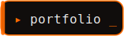
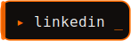
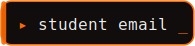
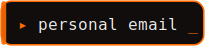
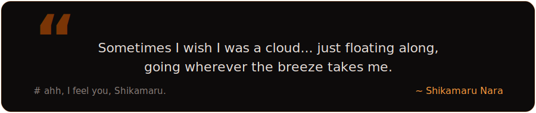

<!-- ────────────────────────────  H E R O  ──────────────────────────── -->

<p align="center">
  
</p>

<p align="center">
  
</p>

<p align="center">
  <a href="https://github.com/yassircherdouh"></a>
  
  
</p>


<!-- ────────────────────────────  A B O U T  ──────────────────────────── -->

<p align="center"></p>

```yaml
role      : AI / Software Developer
school    : The National School of Artificial Intelligence (ENSIA)
based_in  : Algeria (open to remote)
currently : AI/Software Engineering intern @MESRS
learning  : Advanced ML
goal      : becoming so good that a non-techie would love diving in
sleep     : background process
anime     : Naruto, Haikyuu!!, GTO
```


<!-- ────────────────────────────  P R O J E C T S  ──────────────────────────── -->

<p align="center"></p>

| Project | What it does |
|---------|--------------|
| **SIKDS** `@MESRS` | Secure institutional docs + AI semantic search, at national-ministry scale. |
| **RAG Enrollment** `@MESRS` | Multilingual AI that walks students through university enrollment so humans don't have to. |
| **Adaptive Exam Prep** | Active learning that finds what you *don't* know and drills exactly that. |

<p align="center">
  <a href="https://yassircherdouh.vercel.app" target="_blank"></a>
</p>


<!-- ────────────────────────────  H A C K A T H O N  ──────────────────────────── -->

<p align="center"></p>

<p align="center">🥉 &nbsp;<b>3rd Place Winner</b> &nbsp;·&nbsp; <b>FORSAtic Hackathon</b>

<p align="center">An NLP system that classifies customer complaints from social media and call centers so support teams triage the urgent ones first.<br /><sub><i>The prize was only a promise..</i></sub></p>


<!-- ────────────────────────────  S T A C K  ──────────────────────────── -->

<p align="center"></p>

<table>
  <tr>
    <td align="right"><code>&nbsp;languages&nbsp;</code></td>
    <td>
      &nbsp;&nbsp;
      &nbsp;&nbsp;
      &nbsp;&nbsp;
      &nbsp;&nbsp;
      
    </td>
  </tr>
  <tr>
    <td align="right"><code>&nbsp;ml / ai&nbsp;</code></td>
    <td>
      &nbsp;&nbsp;
      &nbsp;&nbsp;
      <picture><source media="(prefers-color-scheme: dark)" srcset="https://cdn.simpleicons.org/langchain/ffffff" /></picture>&nbsp;&nbsp;
      &nbsp;&nbsp;
      
    </td>
  </tr>
  <tr>
    <td align="right"><code>&nbsp;web / app&nbsp;</code></td>
    <td>
      &nbsp;&nbsp;
      <picture><source media="(prefers-color-scheme: dark)" srcset="https://cdn.simpleicons.org/nextdotjs/ffffff" /></picture>&nbsp;&nbsp;
      &nbsp;&nbsp;
      &nbsp;&nbsp;
      &nbsp;&nbsp;
      &nbsp;&nbsp;
      
    </td>
  </tr>
  <tr>
    <td align="right"><code>&nbsp;backend&nbsp;</code></td>
    <td>
      &nbsp;&nbsp;
      <picture><source media="(prefers-color-scheme: dark)" srcset="https://cdn.simpleicons.org/express/ffffff" /></picture>&nbsp;&nbsp;
      <picture><source media="(prefers-color-scheme: dark)" srcset="https://cdn.simpleicons.org/django/ffffff" /></picture>
    </td>
  </tr>
  <tr>
    <td align="right"><code>&nbsp;databases&nbsp;</code></td>
    <td>
      &nbsp;&nbsp;
      &nbsp;&nbsp;
      &nbsp;&nbsp;
      &nbsp;&nbsp;
      
    </td>
  </tr>
  <tr>
    <td align="right"><code>&nbsp;devops&nbsp;</code></td>
    <td>
      &nbsp;&nbsp;
      &nbsp;&nbsp;
      &nbsp;&nbsp;
      <picture><source media="(prefers-color-scheme: dark)" srcset="https://cdn.simpleicons.org/gnubash/ffffff" /></picture>&nbsp;&nbsp;
      
    </td>
  </tr>
</table>


<!-- ────────────────────────────  C O N N E C T  ──────────────────────────── -->

<p align="center"></p>

<p align="center">
  <a href="https://yassircherdouh.vercel.app" target="_blank"></a>
  &nbsp;
  <a href="https://linkedin.com/in/yassircherdouh" target="_blank"></a>
</p>
<p align="center">
  <a href="mailto:yassir.cherdouh@ensia.edu.dz"></a>
  &nbsp;
  <a href="mailto:yassir.cherdouh13@gmail.com"></a>
</p>


<!-- ────────────────────────────  Q U O T E  ──────────────────────────── -->

<p align="center"></p>

<br />

<!-- ────────────────────────────  P A C - M A N  ──────────────────────────── -->

<picture>
  <source media="(prefers-color-scheme: dark)" srcset="https://raw.githubusercontent.com/yassircherdouh/yassircherdouh/output/pacman-contribution-graph-dark.svg">
  <source media="(prefers-color-scheme: light)" srcset="https://raw.githubusercontent.com/yassircherdouh/yassircherdouh/output/pacman-contribution-graph.svg">
  
</picture>
